# 🎬 Studio Ghibli World - Interactive Web Experience

A stunning, immersive web application celebrating the magical universe of Studio Ghibli films. Built with React and modern web technologies, this project features interactive character exploration, comprehensive movie database, AI-powered story creation, and beautiful animations inspired by the enchanting world of Studio Ghibli.

## 🌟 Features

### 🏠 **Landing Page**
- **Dynamic Theme System**: Beautiful light/dark mode toggle with smooth transitions
- **Parallax Animations**: Floating clouds, spirits, and interactive background elements
- **Responsive Design**: Optimized for desktop, tablet, and mobile devices
- **Custom SVG Icons**: Hand-crafted Totoro, No-Face, Soot Sprites, and other Ghibli characters
- **Film Showcase**: Featured films collection with ratings and descriptions
- **Character Gallery**: Interactive character cards with detailed information

### 🎭 **Characters Page**
- **Comprehensive Character Database**: Detailed profiles of beloved Ghibli characters
# 🌿 Studio Ghibli — Wander & Wonder


  

A small, affectionate fan app that invites you to wander Studio Ghibli's gentle, strange worlds. Explore films and characters, spark tiny stories, and collect moments that feel hand-painted.

---

## Peek

| Browse | Create | Collect |
|---:|:---:|:---|
|  |  |  |

*Images above are placeholders — drop screenshots into `public/` with the same names (or overwrite these SVGs) to show them here.*


## Diagrams

### Site map

```mermaid
flowchart LR
	A[🌿 Landing] --> B[🎬 Movies]
	A --> C[🎭 Characters]
	A --> D[✍️ Story Creator]
	B --> E[🔍 Film Detail]
	C --> F[👤 Character Card]
	D --> G[✨ Generated Story]
	G --> H[📚 Save to Gallery]
	E --> H
	F --> H
```



### Component overview


- 🌸 Explore: film library and character gallery with short, captivating notes.
- ✨ Create: a tiny Ghibli-style story generator to inspire vignettes and daydreams.
- 📚 Collect: save favorite moments into a personal gallery.

---

## Quick Start

1. Open the app and wander — choose a film or character to begin.
2. Visit the Story Creator to seed a short, whimsical tale.
3. Save favorites to your gallery and return whenever you need a little wonder.

```text
Open: npm run dev  →  Visit http://localhost:5173
``` 

---

## Visual Notes

- Replace `public/hero-placeholder.png` and `public/screen-*.png` with your screenshots for an instant visual lift.
- Keep the copy short and sensory — this README is a tiny posterboard for the app's feeling.

---

> This is a fan celebration of Studio Ghibli’s warmth, mystery, and gentle magic — not affiliated with Studio Ghibli.

— Made with affection for Ghibli fans everywhere
— Made with affection for Ghibli fans everywhere